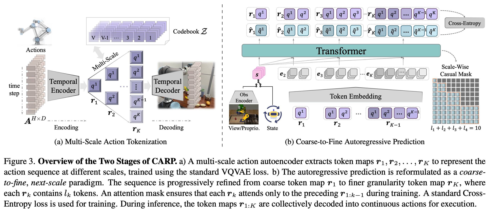
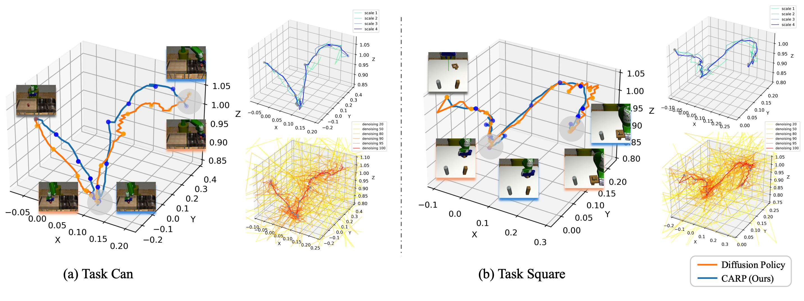

<div align=center>

<h1> 
CARP: Visuomotor Policy Learning <br>
via Coarse-to-Fine Autoregressive Prediction 
</h1>

<h4 align="center"> 
<a href='https://zhefeigong.github.io/'>Zhefei Gong</a><sup>1</sup>
<a href='https://dingpx.github.io/'>Pengxiang Ding</a><sup>12</sup>,
<a href='https://scholar.google.com/citations?user=3_DtxJ8AAAAJ&hl=zh-CN'>Shangke Lyu</a><sup>1</sup>,
<a href='https://kyonhuang.top/'>Siteng Huang</a><sup>12</sup>,
<a href='https://github.com/ZhefeiGong'>Mingyang Sun</a><sup>12</sup>,
<a href='https://github.com/ZhefeiGong'>Wei Zhao</a><sup>1</sup>,<br>
<a href='https://zhaoxinf.github.io/'>Zhaoxin Fan</a><sup>3</sup>,
<a href='https://en.westlake.edu.cn/faculty/donglin-wang.html'>Donglin Wang</a><sup>1✉</sup>,


<sup>1</sup>Westlake University, <sup>2</sup>Zhejiang University, <br>
<sup>3</sup>Beijing Advanced Innovation Center for Future Blockchain and Privacy Computing

</h4>

<a href='https://arxiv.org/abs/2412.06782'></a> 
<a href='https://carp-robot.github.io/'></a>
<a href='https://huggingface.co/zhefeigong/carp'></a>

</div>

## 🔥 News

* **`2025.03.05`** We've released the [code](./multitask/) for CARP on the multi-task benchmark (image-based). Stay tuned for the upcoming release of the single-task code for both state and image-based tasks.
* **`2024.12.09`** CARP has been released on [arXiv](https://arxiv.org/abs/2412.06782), along with a dedicated [homepage](https://carp-robot.github.io/) where you can explore its performance and architecture directly.


## 🧾 TBD

- [x] Release paper on arXiv
- [x] Release code based on <a href='./multitask/'>multi-task</a>
- [ ] Release code based on <a href='./singletask/'>single-task</a> which includes both state and image-based tasks


## 👀 Overview

<p align="center">  </p>

> **TL;DR**: introduce **C**oarse-to-**F**ine **A**uto**R**egressive Policy (**CARP**), a novel paradigm for visuomotor policy learning that redefines the autoregressive action generation process as a **coarse-to-fine**, next-scale approach. 

<p align="center">  </p>

> The left panel shows the final predicted trajectories for each task, with CARP producing smoother and more consistent paths than Diffusion Policy (DP). 
The right panel visualizes intermediate trajectories during the refinement process for CARP (top-right) and DP (bottom-right). 
DP displays considerable redundancy, resulting in slower processing and unstable training, as illustrated by 6 selected steps among 100 denoising steps. 
In contrast, CARP achieves efficient trajectory refinement across all 4 scales, with each step contributing meaningful updates.


## 💻 Code

Here, we provide two categories of code mentioned in the paper: `Multi-Task` for the Image-Based MimicGen Benchmark, following the same settings as SDP.
`Single-Task` for both Robomimic and Kitchen tasks, aligned with DP.
Just a heads-up: we've neatly centralized parameter management in `arg_util.py`. 
Before diving into any changes, take a look at this file—it'll make life a lot easier!

* [Multi-Task](./multitask/)
* [Single-Task](./singletask/)


## 🙏 Acknowledgment

We sincerely thank the creators of the excellent repositories, including 
[Visual Autoregressive Model](https://github.com/FoundationVision/VAR), 
[Diffusion Policy](https://github.com/real-stanford/diffusion_policy),
and [Sparse Diffusion Policy](https://github.com/AnthonyHuo/SDP), 
which have provided invaluable inspiration.


## 🏷️ License

This repository is released under the MIT license. See [LICENSE](./LICENSE) for additional details.


## 📌 Citation

If our findings contribute to your research, we would appreciate it if you could consider citing our paper in your publications.

```bibtex
@misc{gong2024carpvisuomotorpolicylearning,
      title={CARP: Visuomotor Policy Learning via Coarse-to-Fine Autoregressive Prediction}, 
      author={Zhefei Gong and Pengxiang Ding and Shangke Lyu and Siteng Huang and Mingyang Sun and Wei Zhao and Zhaoxin Fan and Donglin Wang},
      year={2024},
      eprint={2412.06782},
      archivePrefix={arXiv},
      primaryClass={cs.RO},
      url={https://arxiv.org/abs/2412.06782}, 
}
```

